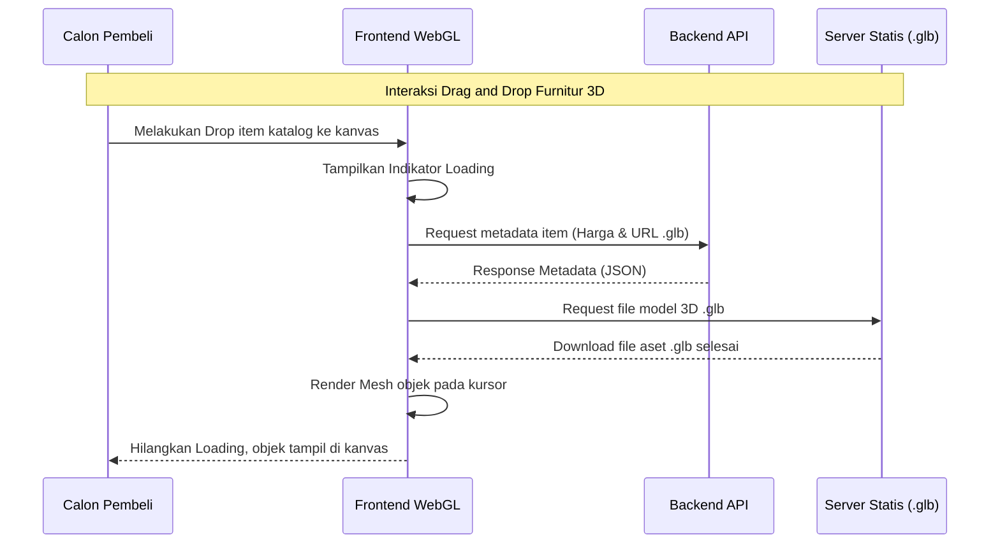
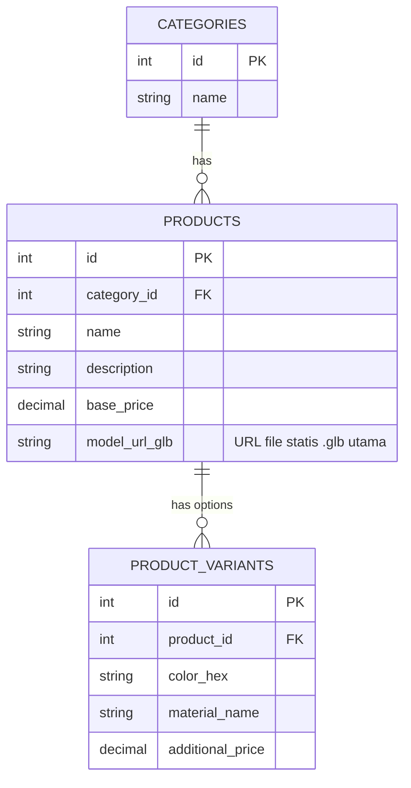

# 📄 PROYEK REQUIREMENTS DOCUMENT (PRD): 3D Interior Design E-Commerce

---

## 1. Overview

Aplikasi ini menyelesaikan masalah calon pembeli yang kesulitan memvisualisasikan ukuran dan kecocokan furnitur di ruangan mereka sebelum melakukan pembelian. Tujuan utama aplikasi ini adalah menyediakan platform e-commerce yang digabungkan dengan kanvas perancangan ruang 3D interaktif untuk meningkatkan kepercayaan dan konversi penjualan produk furnitur internal. Target pengguna utama adalah calon pembeli (*end-user*) yang bertindak sebagai *guest* di platform, dan pengelola toko (Admin) untuk manajemen katalog. Platform utama difokuskan pada Web Browser versi Desktop untuk memaksimalkan pengalaman ruang kanvas 3D. Ruang lingkup versi pertama (MVP) dibatasi hanya untuk penjualan produk internal (fase 1 tanpa fitur *marketplace* pihak ketiga), kustomisasi dimensi ruangan, fitur *drag and drop* furnitur 3D, serta informasi harga *real-time*.

---

## 2. High-Level Requirements

- **Aksesibilitas:** Berbasis *web* (tidak perlu diinstal). Fokus interaksi penuh pada Desktop Web. Untuk penggunaan di Mobile bersifat *read-only* atau sekadar berfungsi sebagai katalog 2D standar.
- **Model Pengguna & Hak Akses:** *Guest access* untuk pembeli yang ingin mencoba simulasi 3D dan *Single Admin* (pengelola/saudara) untuk mengunggah model 3D dan mengatur harga.
- **Metode Input Data:** Input pengguna berupa ketikan manual untuk dimensi panjang dan lebar ruangan. Admin mengunggah file statis aset 3D dengan format `.glb` secara manual.
- **Spesifisitas Data Wajib:** Model 3D harus dibatasi jumlah poligonnya di bawah 20k-50k *vertices* per model sebelum diekspor ke format `.glb`. Data harga dan varian warna/material juga merupakan data yang wajib dikaitkan dengan setiap produk.
- **Notifikasi & Alert:** Wajib ada indikator *loading* per objek furnitur saat di- *drag* ke kanvas karena file 3D memakan waktu lebih lama untuk diunduh (mencegah layar *freeze*).
- **Batasan Operasional:** Tidak membutuhkan sistem *checkout* yang kompleks untuk MVP, pemesanan dapat diarahkan ke kontak langsung. Tidak perlu dukungan skema komisi *marketplace* pihak ketiga di Fase 1.

---

## 3. Core Features (MVP Scope)

### a. **Kustomisasi Ukuran Ruang** 

- **Deskripsi Fungsi:** Memungkinkan pengguna membuat ruangan kanvas simulasi sesuai dengan ukuran rumah mereka sebenarnya.

- **Input Wajib:** Angka panjang dan lebar ruangan (dalam meter/cm).

- **Logika/Validasi:** Angka tidak boleh minus atau nol. Sistem secara proporsional men- *generate* lantai dan dinding pembatas.
 
- **Output/Hasil:** Sebuah ruangan kanvas 3D kosong muncul di tengah layar.

### b. **Katalog *Drag and Drop* 3D**
 
- **Deskripsi Fungsi:** Memilih furnitur dari katalog untuk diletakkan ke dalam simulasi ruangan 3D.

- **Input Wajib:** Interaksi *drag* dari panel *overlay* katalog dan *drop* di area kanvas.

- **Logika/Validasi:** Memuat file aset `.glb` dari *server*. Mendeteksi *collision* agar furnitur diletakkan di atas lantai.

- **Output/Hasil:** Objek 3D tampil dan bisa dipindah-pindah posisinya tanpa memuat ulang (*reload*) halaman.

### c. **Informasi Harga *Real-Time***
- **Deskripsi Fungsi:** Menampilkan estimasi harga tanpa mengganggu antarmuka simulasi.

- **Input Wajib:** *Hover* (mengarahkan kursor) pada objek 3D di dalam kanvas.

- **Logika/Validasi:** Mendeteksi objek 3D yang aktif dan menarik metadata harga dari basis data.

- **Output/Hasil:** *Tooltip* yang menampilkan nama produk beserta harganya.

### d. **Kustomisasi Varian Furnitur**

- **Deskripsi Fungsi:** Mengubah warna atau material dari furnitur langsung di dalam ruangan simulasi.

- **Input Wajib:** Klik pada model 3D dan pilihan varian warna/material.

- **Logika/Validasi:** Mengganti *texture* atau kode hex material pada kerangka model 3D klien.

- **Output/Hasil:** Tampilan furnitur seketika berubah warna secara mulus dan murni di sisi *client* tanpa perpindahan halaman.

---

## 4. User Flow / Workflow

1. **Langkah 1 (Akses):** Pengguna mengunjungi *website* utama tanpa perlu mendaftar (berfungsi sebagai *guest*).
2. **Langkah 2 (Setup/Konfigurasi Awal):** Pengguna diminta untuk memasukkan ukuran asli panjang dan lebar ruangan mereka pada form *pop-up* di halaman *Home*.
3. **Langkah 3 (Eksekusi - Perancangan 3D):** Ruang 3D kosong selesai di- *generate*. Pengguna membuka panel katalog di bagian samping, lalu menarik (*drag*) ikon furnitur dan meletakkannya (*drop*) di dalam kanvas tersebut.
4. **Langkah 4 (Eksplorasi Katalog):** Saat furnitur sudah diletakkan, pengguna mengarahkan kursor (*hover*) ke furnitur untuk melihat estimasi harganya secara langsung. Pengguna juga dapat mengubah opsi material/warna furnitur tersebut jika tersedia.
5. **Langkah 5 (Verifikasi & Feedback Sistem):** Sistem selalu memberikan indikator *loading* visual (misalnya *spinner*) pada area kursor ketika file `.glb` sedang diunduh untuk diletakkan.
6. **Cabang/Keputusan:** Setelah puas dengan tata letak, pengguna dapat menekan tombol untuk beralih ke proses pemesanan.

---

## 5. System Architecture & Data Flow

* **Frontend:** Menggunakan *library* rendering WebGL seperti Three.js (atau React Three Fiber) yang berjalan murni di sisi *client*.
* **Backend/Logic:** Node.js API yang ringan untuk melayani data teks, kategori, dan metadata varian produk furnitur.
* **Database:** Relational Database (seperti PostgreSQL) untuk menyimpan rincian harga produk dan referensi URL statis aset model.
* **Alur Data Kunci:** Server dengan spesifikasi setara 6 Core dan 18GB RAM difokuskan secara khusus untuk menangani *bandwidth* saat pengiriman file statis (`.glb`) kepada pengguna secara konstan. Jika dimungkinkan, server menggunakan teknologi *caching* seperti CDN.

**Diagram Sequence (Mermaid):**

---

## 6. Database Schema / Data Model

* **Entitas/Table Utama:** `Products`, `Product_Variants`, `Categories`.
* **Relasi Antar Tabel:** Kategori memiliki banyak produk (1:N), Produk memiliki banyak Varian model/warna (1:N).

**ERD (Mermaid):**

**Deskripsi Tabel:**

| Tabel | Deskripsi |
| --- | --- |
| `Categories` | Menyimpan jenis-jenis furnitur (contoh: Kursi, Meja, Lemari). |
| `Products` | Menyimpan entitas produk utama beserta harga dasar dan tautan (*hotlink*) ke berkas model 3D aslinya (`.glb`). |
| `Product_Variants` | Menyimpan opsi kustomisasi seperti kode warna hex atau jenis material pada produk yang sama, beserta penyesuaian harga jika ada. |

---

## 7. Design & Technical Constraints

* **High-Level Tech Guidelines:** Prioritaskan performa eksekusi WebGL. Batasi ukuran dan geometri dari model 3D, targetkan di bawah 20k-50k poligon (*vertices*) per model saat diekspor untuk menjaga kelancaran animasi kanvas.
* **Aturan Tipografi/UI:** Area UI yang menumpuk (overlay) di atas kanvas harus dipertahankan pada tingkat minimal agar sudut pandang (*viewport*) ruangan 3D menjadi luas. Gunakan fon sans-serif yang modern (misalnya Roboto atau Inter) untuk estetika yang bersih.
* **Keamanan & Autentikasi:** Terapkan aturan *Cross-Origin Resource Sharing* (CORS) yang sangat ketat pada server/CDN. Hal ini mencegah *website* lain yang tidak sah untuk melakukan *hotlink* atau mengambil model `.glb` properti intelektual saudara Anda.
* **Batasan Fungsional:** Versi awal (MVP) dirancang khusus untuk pengalaman Web Desktop saja. Marketplace pihak ketiga juga ditiadakan di fase pertama.
* **Prinsip UX:** Tidak boleh ada *reload* halaman sama sekali saat proses penggantian ukuran ruangan, modifikasi warna furnitur, dan pemindahan letak. Wajib menempatkan respon visual (animasi *loading*) saat mengunduh suatu aset.