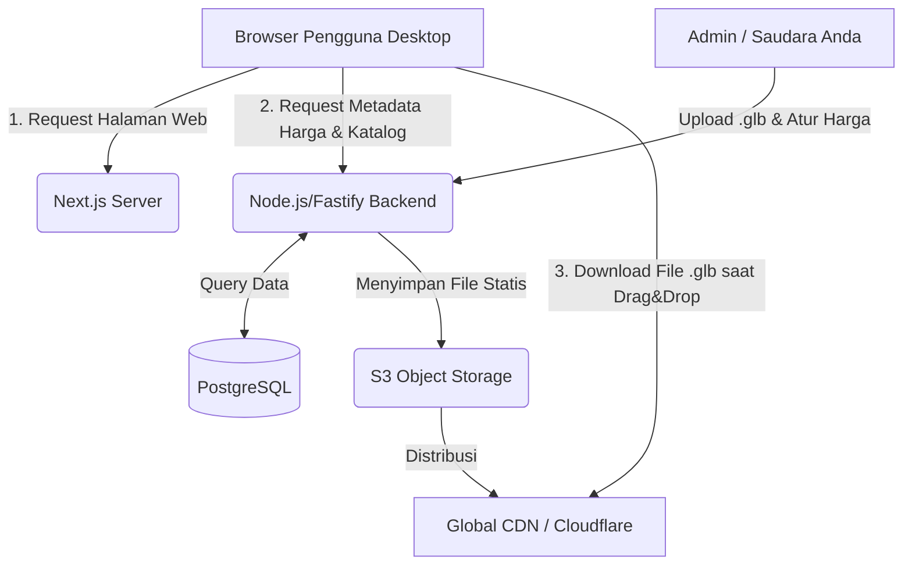

# 🛠️ TECHNICAL REQUIREMENTS DOCUMENT (TRD)

**Proyek:** 3D Interior Design E-Commerce App

**Fase:** MVP (Web Desktop)

## 1. Pendahuluan

Dokumen ini menguraikan arsitektur sistem, pemilihan teknologi, dan standar teknis untuk mewujudkan platform e-commerce dengan fitur *drag-and-drop* furnitur 3D. Fokus utama rekayasa perangkat lunak ini adalah memastikan rendering 3D berjalan pada 60 FPS (Frames Per Second), perpindahan data yang instan tanpa *reload* halaman, dan kualitas aset visual yang fotorealistik namun ringan.

---

## 2. Pemilihan Teknologi (Tech Stack) & Justifikasinya

Untuk mencapai kombinasi visual yang menawan dan performa tinggi, kita tidak bisa menggunakan teknologi web konvensional. Berikut adalah tumpukan teknologi (*stack*) yang direkomendasikan:

### A. Frontend (UI & 3D Rendering)

* **Core Framework:** **Next.js (React)** * *Alasan:* Next.js memberikan keunggulan SEO (penting untuk e-commerce) dan pemuatan halaman awal yang sangat cepat melalui *Server-Side Rendering* (SSR).
* **3D Engine:** **React Three Fiber (R3F) + Drei**
* *Alasan:* R3F adalah pembungkus (wrapper) ekosistem **Three.js** untuk React. Menggunakan R3F memungkinkan kita merender objek WebGL dengan performa asli Three.js, namun mempermudah pengelolaan interaksi *drag-and-drop*, *hover*, dan ganti material karena terhubung langsung dengan *state* React.

* **State Management:** **Zustand**
* *Alasan:* Sangat krusial. Jangan gunakan Redux atau Context API standar karena akan memicu *re-render* pada seluruh UI saat objek 3D dipindah-pindah (menyebabkan *lag*). Zustand sangat ringan dan memungkinkan kita meng-update *state* kanvas 3D tanpa me-render ulang UI panel HTML di luarnya.

* **UI / UX Styling:** **Tailwind CSS + Framer Motion**
* *Alasan:* Tailwind menjamin UI (*overlay*, panel, tombol) yang *clean* dan responsif. Framer Motion digunakan untuk memberikan animasi transisi masuk/keluar panel katalog yang sangat *smooth*, memberikan kesan premium layaknya aplikasi *native*.

### B. Backend & Database

* **Backend API:** **Node.js dengan Fastify (atau NestJS)**
* *Alasan:* Fastify memiliki performa *routing* yang jauh lebih cepat daripada Express.js. API ini murni hanya akan melempar data JSON (metadata harga, nama barang) secara cepat.

* **Database:** **PostgreSQL + Prisma ORM**
* *Alasan:* PostgreSQL sangat andal untuk relasi produk dan varian. Prisma ORM menjamin tipe data aman (*type-safe*) yang meminimalisir *bug* di sisi *backend*.

### C. Infrastruktur & Aset (Kunci Performa Utama)

* **Penyimpanan Statis:** **AWS S3 (atau Cloudflare R2)** + **CDN (Content Delivery Network)**
* *Alasan:* Server utama (6 Core, 18GB RAM) **TIDAK BOLEH** digunakan untuk mengirim file `.glb` langsung ke pengguna. File `.glb` harus disimpan di Object Storage dan disebarkan melalui jaringan CDN (Edge nodes). Ini membuat waktu *loading* aset 3D pengguna selalu cepat terlepas dari lokasi mereka, dan server utama tidak akan *down* atau kehabisan *bandwidth*.

---

## 3. Optimasi Pipeline Aset 3D (Wajib Diimplementasikan)

Kualitas visual berbanding terbalik dengan ukuran file. Untuk mengatasi hal ini, diperlukan *pipeline* aset yang ketat:

1. **Format Wajib:** `.glb` (GLTF Binary).
2. **Batas Geometri:** Maksimal 20.000 - 50.000 *vertices* per model.
3. **Teknologi Kompresi Draco (Draco Compression):** Ini adalah teknologi dari Google. Semua file `.glb` buatan saudara Anda **wajib** dikompres menggunakan Draco sebelum diunggah ke server. Ini bisa mengecilkan ukuran file 3D hingga 70-80% tanpa mengurangi detail visual (misal: file 15MB menjadi hanya 3MB).
4. **Baking Textures & PBR:** Daripada menggunakan banyak perhitungan cahaya real-time yang berat, bayangan statis pada furnitur harus di-*bake* (ditanam langsung ke tekstur gambar) melalui Blender. Gunakan tekstur PBR (Physically Based Rendering) agar kayu atau logam terlihat nyata namun tetap ringan di WebGL.

---

## 4. Arsitektur Sistem & Aliran Data

---

## 5. Skema Basis Data (Struktur PostgreSQL)

Melanjutkan skema ERD dari PRD, berikut rancangan level teknisnya:

| Table Name | Column | Data Type | Constraints | Deskripsi |
| --- | --- | --- | --- | --- |
| `categories` | `id` | UUID | PRIMARY KEY | ID Unik Kategori |
|  | `name` | VARCHAR(100) | NOT NULL | Contoh: "Kursi Duduk" |
| `products` | `id` | UUID | PRIMARY KEY | ID Unik Produk |
|  | `category_id` | UUID | FOREIGN KEY | Relasi ke `categories` |
|  | `name` | VARCHAR(255) | NOT NULL | Nama Furnitur |
|  | `base_price` | DECIMAL | NOT NULL | Harga Dasar Produk |
|  | `glb_url` | TEXT | NOT NULL | URL lengkap ke CDN untuk file aset 3D utama |
| `product_variants` | `id` | UUID | PRIMARY KEY | ID Varian |
|  | `product_id` | UUID | FOREIGN KEY | Relasi ke `products` |
|  | `color_hex` | VARCHAR(7) | NULL | Contoh: "#FF5733" |
|  | `material_type` | VARCHAR(50) | NULL | Contoh: "Wood", "Metal" |
|  | `additional_price` | DECIMAL | DEFAULT 0 | Penyesuaian harga jika varian ini lebih mahal |

---

## 6. Integrasi Frontend - UX & State Flow

Untuk memastikan spesifikasi "Tidak boleh ada *reload* halaman" dan "Harus ada visual feedback", sistem akan mengadopsi pola berikut:

1. **Suspense & Preloading:** Menggunakan fitur `<Suspense>` dari React. Saat pengguna men-*drag* kursi ke kanvas, UI langsung menampilkan animasi *spinner/loading* estetik menggunakan *Framer Motion* di titik koordinat kursor, sementara aset `.glb` diunduh di belakang layar secara asinkron (menggunakan `useGLTF` hook dari Drei).
2. **Material Instancing:** Saat pengguna mengganti warna varian kursi di kanvas, aplikasi tidak mengunduh ulang kursi tersebut. Sistem hanya menargetkan properti material (kode hex) dari *mesh* 3D yang sudah ada di memori dan merender ulang warnanya secara instan.
3. **Raycasting (Interaksi Mouse):** Three.js akan menggunakan *Raycaster* untuk mendeteksi kapan kursor melayang (*hover*) di atas *mesh* 3D kursi. Ketika terdeteksi, titik koordinat 3D diterjemahkan menjadi koordinat 2D layar untuk memunculkan HTML *Tooltip* Harga secara dinamis dan menempel pada kursor.

---

## 7. Keamanan & Kebijakan CORS

Sebagai bentuk perlindungan IP (Intellectual Property) model 3D saudara Anda:

1. **Strict CORS:** Server S3/CDN wajib dikonfigurasi dengan aturan `Access-Control-Allow-Origin` yang HANYA mengizinkan *domain website* resmi saudara Anda. Jika *website* pesaing mencoba memasang URL `.glb` Anda di *website* mereka (*hotlinking*), permintaan akan otomatis diblokir oleh *browser*.
2. **Rate Limiting:** Terapkan pembatasan *request* di API Backend untuk mencegah serangan DDoS atau *bot* yang mencoba melakukan *scraping* daftar katalog dan harga produk.